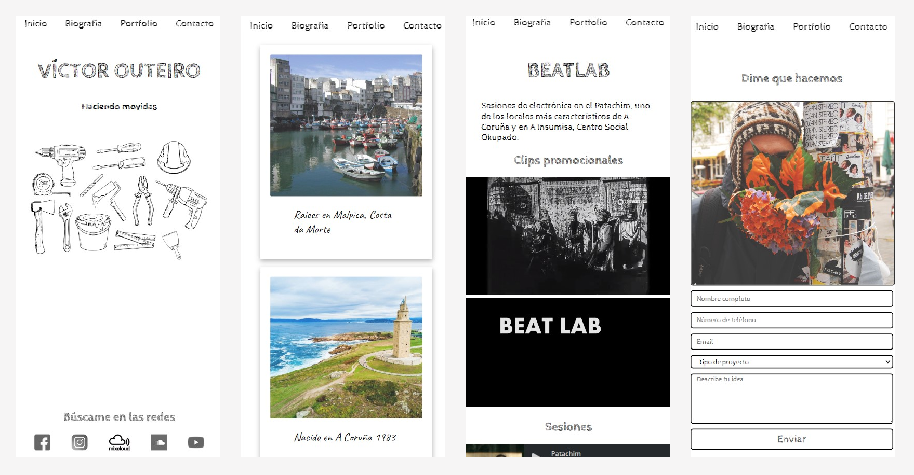
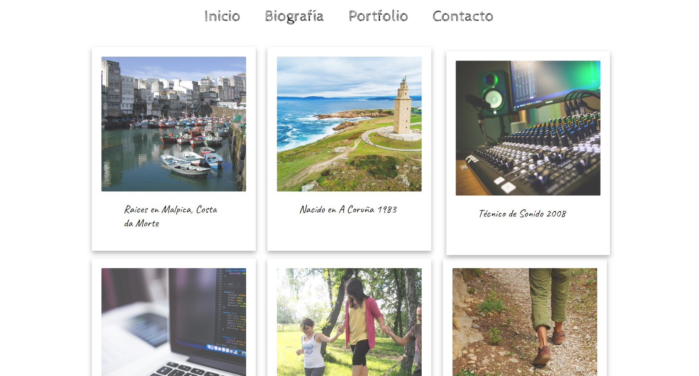

# Personal Webpage

My first project at the Bootcamp course. A personal webpage buit only with HTML, CSS and a "mobile first" design. 

## Table of contents

- [Overview](#overview)
  - [The challenge](#the-challenge)
  - [Screenshot](#screenshot)
  - [Links](#links)
- [My process](#my-process)
  - [Built with](#built-with)
  - [Key points](#key-points) 
  - [What I learned](#what-i-learned)
  - [Continued development](#continued-development)
- [Acknowledgments](#acknowledgments)

## Overview

### The challenge

- The web site shoud have diferent sections that will be built in diferent HTML files
- Each view should have a navigation bar that allows user to move throw the different sections
- The project shoud have al least the following sections:
    Home
    Biography
    Portfolio
    Contact

### Screenshot

### Links

- Solution URL: (https://web-personal-omega.vercel.app/)

## My process

### Built with

- Semantic HTML5 markup
- CSS
- Flexbox
- Mobile-first workflow
- JavaScript

### Key points

- Firstime doing a web responsive site. Understanding the use of CSS for the layout of the elements

### Continued development

- Try also display-grid for the layout
- Implement the real use of the contact form

## Acknowledgments

Thanks a million to my teacher Miguel Jimenez, my first teacher at The Bridge. My ramp up was possible thanks to him.
